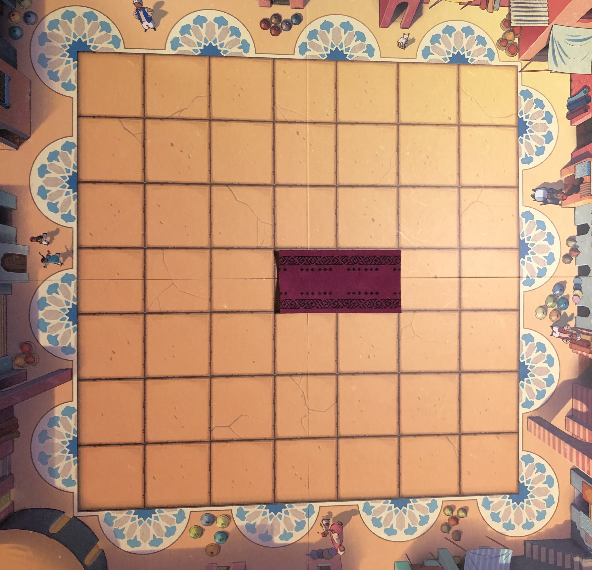
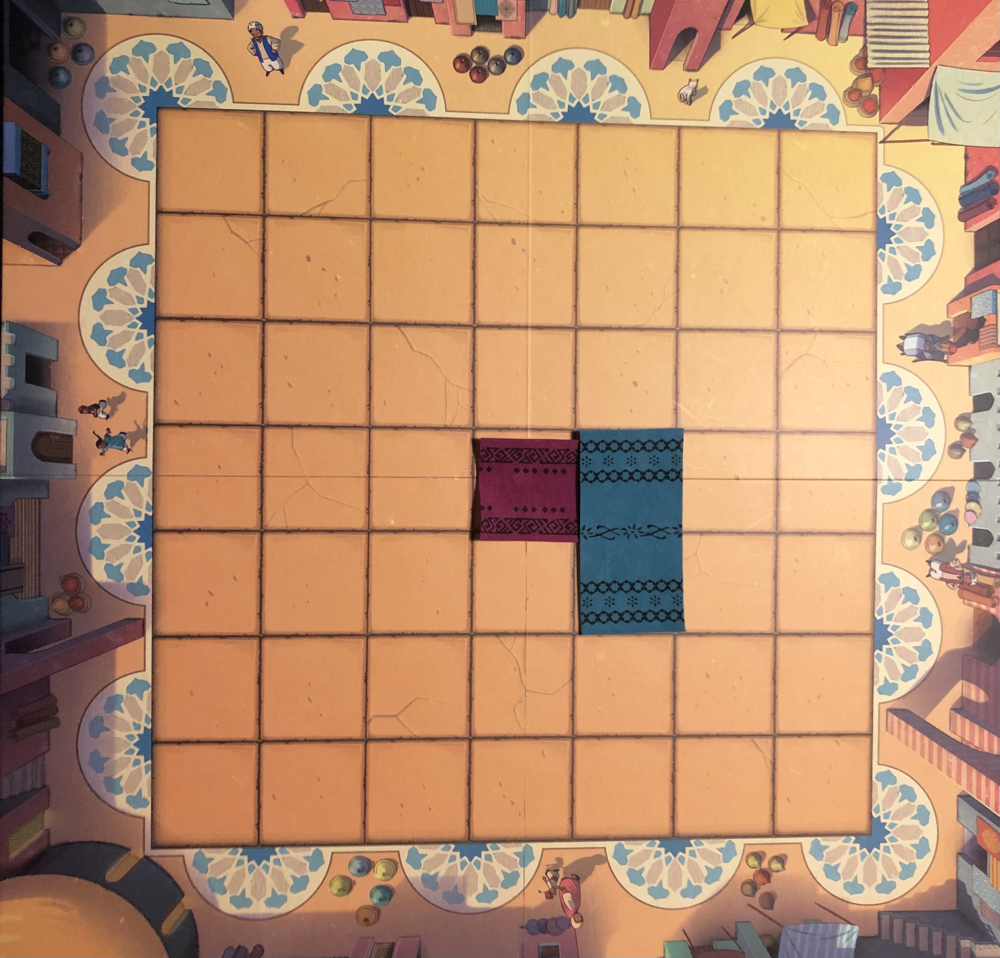
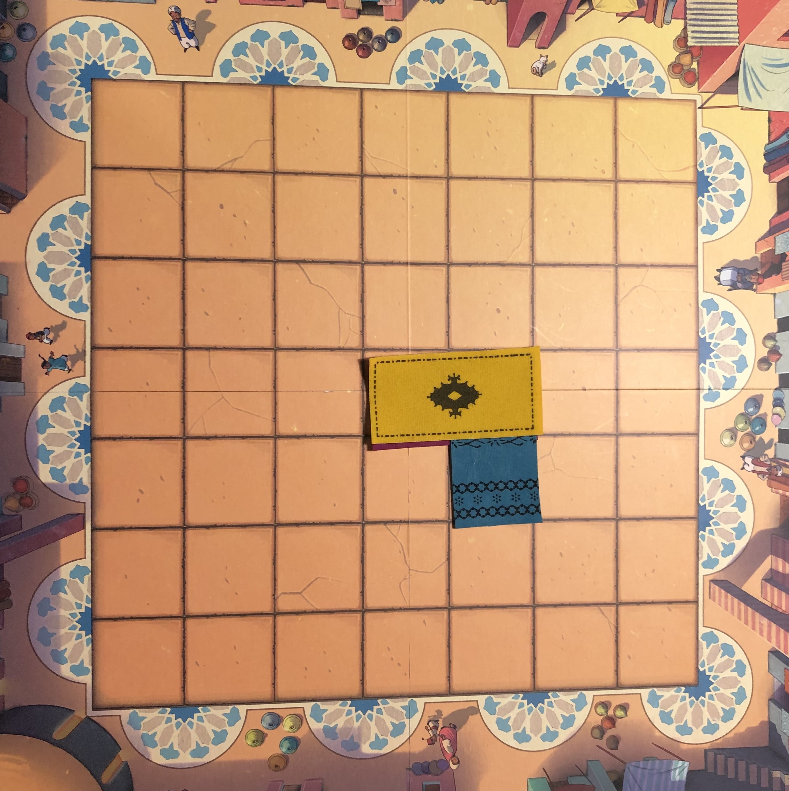

# COMP1110 Assignment 2

## Academic Honesty and Integrity

Honesty and integrity are of utmost importance. These goals are *not* at odds with being resourceful and working collaboratively.
You *should* be resourceful, you should collaborate within your team, and you should discuss the assignment and other aspects of the course with others taking the class.
However, *you must never misrepresent the work of others as your own*. If you have taken ideas from elsewhere or used code sourced from elsewhere, you must say so with *utmost clarity*.
At each stage of the assignment you will be asked to submit a statement of originality, either as a group or as individuals.
This statement is the place for you to declare which ideas or code contained in your submission were sourced from elsewhere.

Please read the ANU's [official position](http://academichonesty.anu.edu.au/) on academic honesty. If you have any questions, please ask a lecturer, tutor, or make a post on the Ed forum.

Carefully review the statements of originality in the [admin](admin) folder which you must complete at each stage.  Edit the relevant statement and update it as you complete each stage of the assignment, ensuring that when you complete each stage, a truthful statement is committed and pushed to your repo.

## Purpose

In this assignment you will *work as a group* to master a number of major themes of this course,
including software design and implementation, group work, using development tools such as Git and IntelliJ,
and using JavaFX to build a user interface.  **Above all, this assignment will emphasize group work**;
while you will receive an individual mark for your work based on your contributions to the assignment,
**you can only succeed if all members contribute to your group's success**.

## Assignment Deliverables

The assignment is worth 35% of your total assessment, and it will be marked out of 35.
So each mark in the assignment corresponds to a mark in your final assessment for the course.
Note that for some stages of the assignment you will get a _group_ mark, and for others you will be _individually_ marked.
The mark breakdown and the due dates are described on the [deliverables](https://cs.anu.edu.au/courses/comp1110/assessments/deliverables/) page.

Your work will be marked via your tutor accessing git, so it is essential that you carefully follow instructions for setting up and maintaining your group repository.
At each deadline you will be marked according to whatever is pushed to your repository at the time of the deadline.
You will also be assessed on how effectively you use git as a development tool.

## Problem Description - Marrakech
In the game of Marrakech, two to four merchants in a crowded Marrakech souk compete to impress the market owner, Assam, in the hopes of being declared the best merchant in Marrakech. Players may direct how Assam wanders through the market to entice him into viewing their rugs, but be careful! If you put Assam on course to land on an opponent's rug, you will have to pay up! 

### The Board and Players

Marrakech is played on a 7x7 board, with a minimum of 2 and a maximum of 4 players. 

Each player starts the game with 15 rugs, which they will place on the board over the course of the game. Each rug is 2 squares long and one square wide (i.e they cover two squares on the board in a straight line).
Each player also has 30 dirhams (the currency in use in this game, and also in Morocco -- don't try and use the money from this game on a real-life trip to Morocco, though). The market owner, Assam, is also represented by a piece on the board, which moves as described below.

### Turns and Phases

Each player's turn consists of three phases:
First is the rotation phase, where a player may optionally rotate Assam.
Then, the player enters the movement phase, where a die is rolled and Assam moves, and the current player may be required to make payment to another player.
These two phases are described in the section [Assam and Payments Between Players](#assam-and-payments-between-players) below.
Last is the placement phase, where the current player must place a rug on the board.
The rules for placing the rug are describe in section [Rug Placement](#rug-placement) below.

The game is over when any player reaches the rotation phase of their turn, but does not have any rugs left to place. To be clear, when the first player places their last rug, the game will continue to allow any remaining players to place their final rugs. It is only over when a player enters the rotation phase and does not have any remaining rugs.

Once the game is over, it is scored. A player's final score is the number of dirhams they have plus the number of squares visible on the board that are of their colour. The player with the highest score wins. If two (or more) players have the same final score, then the player with the largest number of dirhams wins. If two (or more) of the tied players have the same number of dirhams, then the game is a draw.

### Assam and Payments Between Players

Assam is a key piece in the game of Marrakech, as he defines where players may place their rugs, as well as when players must pay other players. 

Assam starts the game in the centre of the board (i.e at position (3,3)), and may be facing in any direction (since the board is a square).

At the beginning of a player's turn, they choose to rotate Assam either 90 degrees to the right or left, or not at all (i.e., leave him facing the same direction).

Then, a special die is rolled to determine how far Assam moves on this turn.
The die is 6-sided, but the sides are numbered 1-4, with the numbers not equally common.
It has:
 - One face which shows a one
 - Two faces which show a two
 - Two faces which show a three
 - One face which shows a four

This means that the die is twice as likely to show a 2 or 3 as it is to show a 1 or 4.

After the die has been rolled, Assam is moved in the direction he is currently facing with the number of spaces he moves matching the number shown on the die. If he goes off the board at any time, he follows a pre-defined mosaic track on the edge of the board in order to be placed back on it and continue his movement. These tracks can be seen in the following image of the board:


Note that following one of these tracks does not count as one of the steps in the movement -- Assam must traverse a number of squares equal to the number shown on the die regardless of whether he left the board at any time during his movement. An example taken from the game rules can be seen here:


Note also that this board image is the canonical one with respect to the mosaic tracks -- that is to say that the three-quarter circles on some of the corners of the board should be in the top-right and bottom left; **not** the top-left and bottom-right. This is important for the unit-tested tasks, which assume this configuration.

If, after his movement ends, Assam lands on an empty square or a rug owned by the player whose turn it is, no payment is made, and the player's turn moves on to the placement phase (described below in the "Turns and Phases" section). If, however, Assam lands on a rug owned by another player then the player who moved him will have to pay the other player. This payment is equal to the size of the connected region of squares that are covered by rugs of the same colour, starting from the square that Assam landed on. Connected here means adjacent in one of the cardinal directions, i.e., sharing an edge; squares that are only diagonally adjacent (sharing only a corner) do not count as connected. The square which Assam landed on does count towards the size of the connected region and thus the payment. If a player is unable to pay the full amount, then they must pay as much as they are able, and then they are out of the game. A player who is out of the game cannot win, nor can they take any further turns. If Assam lands on one of their rugs later in the game, it is as though Assam landed on an empty square, and no payment is required.

Please see the following images for some example situations and their associated payments required. In each of these examples it is assumed that the player who moved Assam does not own the rug that he has landed on.


### Rug Placement

**NOTE**: the pictures in this section depict the board, rotated by 90 degrees clockwise. ***This is not the way the board is depicted in the game***. The board is instead depicted as it is in [this picture](assets/Board%20Image.png), in the section "[Assam and Payments Between Players](#assam-and-payments-between-players)".

After Assam has moved and any required payment is completed, the current player must place a rug on the board according to the following conditions:
- At least one of the squares of the rug must be adjacent to (share an edge with) the square that Assam occupies.
- The rug must not be placed under Assam.
- The rug may not cover both squares of another rug that is already on the board, if both squares of that rug are visible (not already covered).

To clarify the third condition, it is acceptable for a rug to cover up part of one or more rugs on the board, but not to be placed directly on top of another rug and cover both squares of it in one turn.
A rug can be placed exactly on top of a previously placed rug if at least one square of the previous rug is already covered by another rug already on the board.

For example, if the current state of the rugs is as in the top-left image, we can see some examples of valid and invalid placements (note that obviously all of these are technically illegal since Assam isn't on the board here, but this serves as an example of the rules surrounding overlapping).


To give a specific example of the third condition, if the board is currently set up like this:



And then the blue player plays like this:



It is legal for the yellow player to play like this, even though it results in covering up an entire purple rug, because it does not cover both squares of that rug in the same turn (one of them has already been covered separately by the blue rug).



## Tasks and Evaluation Criteria

The assignment is broken down into a set of tasks, and a set of deliverables.
Deliverables are listed on [the deliverables page](https://cs.anu.edu.au/courses/comp1110/assessments/deliverables/) of the course web site.
There is not a direct correspondence between tasks and deliverables: some of the tasks are included in more than one deliverable (e.g., tasks 3, 4 and 5 are included in both [D2C](https://cs.anu.edu.au/courses/comp1110/assessments/deliverables/#D2C) and [D2F](https://cs.anu.edu.au/courses/comp1110/assessments/deliverables/#D2F) meaning you can get marks twice for completing these tasks), and some of the deliverables require you to do things not in the list of tasks below (e.g., integration test and code review).

#### Part One

* Task 1: Read the instructions, fork the assignment repo, and complete admin files.
Detailed instructions for this task are found in [course deliverable D2A](https://cs.anu.edu.au/courses/comp1110/assessments/deliverables/#D2A).
* Task 2: Make an initial *design* for your implementation of the game, including skeleton code.
Read the description of [deliverable D2B](https://cs.anu.edu.au/courses/comp1110/assessments/deliverables/#D2B) for more information about what your design should include.
* Task 3: Begin the implementation of your design by storing appropriate information in instances of your classes. We will provide you with a string representation of game states (see section [String Representation](#string-representation) below) for testing purposes. Your first implementation step should be to internalise this representation, i.e., to create instances of the classes in your design initialised with the information from the string representation.
* Task 4: Implement the `isRugValid()` method in the `Marrakech` class.
* Task 5: Construct a state viewer for your game, allowing you to visualise a game state String.
* Task 6: Implement the `rollDie()` method in the `Marrakech` class.

Part one of the assignment culminates in [deliverable D2C](https://cs.anu.edu.au/courses/comp1110/assessments/deliverables/#D2C).

#### Part Two

In part two, your main objective is to create a working game, using JavaFX to implement a playable graphical version of the game in a 1200x700 window.

Aside from the window size, the details of exactly how the game appears and how players interact with it are **intentionally** left up to you. The images above are for illustration purposes only.
A good game implementation should be faithful to the game rules, as described above, and have an easy-to-use, intuitive user interface.
However, the evaluation (marking) of Tasks 7 and 15 below are not all-or-nothing: we will consider different aspects of the game, and the degree or extent to which each of them has been achieved.

The only **firm** requirements are that:
* you use Java 17 and JavaFX,
* it runs in a 1200x700 window, and
* that it is executable on a standard lab machine from a jar file called `game.jar`.

Your game must successfully run from `game.jar` from within another
user's (i.e.  your tutor's) account on a standard lab machine (in
other words, your game must not depend on features not self-contained
within that jar file and the Java runtime).

* Task 7: Implement a basic playable game.
For the game to be playable, the GUI should display the state of the game,
allow players to take turns, follow the phases of each turn, and update the
state shown to reflect players' actions. It does not have to implement all
rules correctly (for example, it may not enforce all rules around rug
placement, may not correctly compute payments between players, may not
compute final scores, etc).
* Task 8: Implement the `isGameOver()` method in the `Marrakech` class.
* Task 9: Implement the `rotateAssam()` method in the `Marrakech` class.
* Task 10: Implement the `isPlacementValid()` method in the `Marrakech` class.
* Task 11: Implement the `getPaymentAmount()` method in the `Marrakech` class.
* Task 12: Implement the `getWinner()` method in the `Marrakech` class.
* Task 13: Implement the `moveAssam()` method in the `Marrakech` class.
* Task 14: Implement the `makePlacement()` method in the `Marrakech` class.
* Task 15: Implement a fully working game.
A fully working game extends the basic game by enforcing all game rules,
ensuring players can in any situation choose all actions that they should be
allowed to take and none that they shouldn't, ending the game when it is
over and declaring the right player the winner.
* Task 16: Implement a random computer player, and integrate it into your game so that the user (human player) can choose to play against one or more computer-controlled players. 
* Task 17: Improve your computer player to make moves based on some kind of intelligent decision-making.

There is no requirement to complete the tasks in the order they are numbered, and you are not required to complete all of them.

### Evaluation Criteria

A detailed breakdown of the marking criteria for each of the deliverables is given on the [deliverables page](https://cs.anu.edu.au/courses/comp1110/assessments/deliverables/) of the course web site.
In coarse terms, the distribution of assignment marks over different categories is:
* Timely and correct completion of admin tasks and files: 6%
* Healthy use of git and teamwork: 6%
* Viewable, playable, and interesting game (tasks 5, 7, 15-16): 26%
* Appropriate object-oriented design and implementation, and other aspects of code quality: 25%
* Unit-testable tasks (tasks 4, 6, 8-14): 24%
* Developing and using tests: 6%
* Code review: 3%
* Presentation: 4%

It is essential that you refer to the [deliverables page](https://cs.anu.edu.au/courses/comp1110/assessments/deliverables/) to understand each of the deadlines and what is  required.
All submitted material be in your team's git repo, and in the *correct* locations, as prescribed
by the [deliverables page](https://cs.anu.edu.au/courses/comp1110/assessments/deliverables/), by each deadline. We will only mark what is in your team's repo; anything else that you have done but not committed or pushed before the deadline will not count.
Some parts of your assignment will be marked via tests run through git's  continuous integration (CI) framework.

## String Representation

In order for us to provide unit tests for some of the tasks listed above, and thus to give you an indication of whether you have correctly solved them, we require a consistent representation of game state shared across all groups. This is done by providing a String representation of the state of the game at any given point. 
The String representation is **only for testing purposes**, and should not be the basis of your solution to the assignment. We expect you to create your own object-oriented representation of the game state, write constructors for your classes that create instances from the information in the game Strings (task 3), and to use your own objects in your implementation of the other tasks.
An implementation that solves the (unit-testable) tasks by manipulating only the String representation will not be eligible for full marks, even if the tasks are solved correctly.
For more guidance on this point, see the section of the FAQ below titled ["What does 'appropriate use of object-oriented features' mean?"](#what-does-appropriate-use-of-object-oriented-programming-features-mean).

Because you will be asked to convert from these Strings into your own state representation, and from your own objects into these Strings to return answers to unit tests, it's worth spending some time going over how they represent the game.
There are three key components to the game String:
 - The player strings
 - The Assam string
 - The board string

Let's go through each of these in turn, and then with that knowledge in hand construct the overall game String.

### Player Strings

A player String consists of 4 pieces of information. It always begins with a `P` character, to signify that it is a player String (and not some other kind of game String).
Then, we have the colour of the player in question. In the game of Marrakech, there are 4 options for the colour of a player, cyan (represented by a `c` character), yellow (represented by a `y` character), red (represented by an `r` character), and purple (represented by a `p` character).
After the colour character, we will have the amount of dirhams this player currently possesses. This should always be a 3-digit number, so if a player has 6 dirhams that's represented as `006`, and if they have 12 dirhams then that's represented as `012`.
Following that, we have the number of rugs remaining for this player to place. Players always start the game with 15 rugs, and lose one every time they place one. This is similarly always a 2-digit number.
Finally, we have a character which designates whether a given player is out of the game. A player who is in the game should have an `i` character in the final place, while a player who is out of the game should have an `o`.
So, for example, in the player string `Pr00803i`, we are representing the red player, who has 8 dirhams, 3 rugs remaining to place on the board, who is in the game.

### Assam String

An Assam String similarly encodes 3 pieces of information. It always begins with an `A` character.
Then, we have the x-coordinate of Assam's current position, followed by the y-coordinate of Assam's current position. These are always 1 digit numbers, since the board is only 7 squares wide. These coordinates are 0-indexed, so the top-left square of the board is (0,0), not (1,1).
Finally, we have Assam's orientation on the board. This can be one of 4 characters, `N`, `E`, `S`, or `W`. These characters refer to cardinal directions, and can be read as follows:
 - When Assam is facing `N`, he is facing towards the top of the board
 - When Assam is facing `E`, he is facing towards the right of the board
 - When Assam is facing `S`, he is facing towards the bottom of the board
 - When Assam is facing `W`, he is facing towards the left of the board

So, for example, in the Assam string `A04N`, Assam is at position (0,4), facing towards the top of the board.

### Rug Strings

A Rug String encodes information about a particular rug that either has been placed on the board, or is about to be placed. A rug string is exactly 7 characters long, and consists of four parts. 
Unlike the others, it does not have a consistent starting character. Instead, it starts with a character that matches the colour of the player who placed this rug on the board (or who is about to place it).
As with the player strings, this can be one of four options: `c`, `y`, `r`, or `p`.
Next, we have a 2-digit numerical ID. This ID can be any number (although having the first rug placed be 00, then the next one be 01, then 02, etc is one sensible system), yet every rug that a player owns must have a distinct ID.
That is to say that no two rugs on the board can share both a colour and an ID.
Finally, we have the x and y coordinates of both squares covered by the rug. As with the Assam strings, these are 0-indexed.
So for example, in the rug String `p014445`, this is a rug with ID 1, owned by the purple player, which covers squares (4,4) and (4,5).

This full rug String is used in tasks that involve evaluating a placement of a potential Rug, while the board String will use an abbreviated rug String, as described in the next section.

### Abbreviated Rug Strings
In addition, we also have abbreviated rug Strings which are used to make a more compact representation of the rugs for the board String. The abbreviated rug String is simply the first three characters of the full rug String. That is, the colour and the ID of the rug. So the purple player's rug with ID 2 would be `p02`.

We also use a special rug string, `n00`, to denote no rug. This is needed for the representation of the visible state of the board, described next.

### Board String

A Board String encodes the visible arrangement of rugs on the board at a given time. The board string begins with the character `B`, which is followed by a sequence of 49 abbreviated rug Strings, one for each square on the board, indicating which is the rug that is visible in that square. Thus, the board string is exactly 3*49=147 characters long.
If a particular square is not covered by any rug, the corresponding abbreviated rug string will be the special null string, `n00`.
The board string is read in column-major order, meaning that it first lists the visible rugs in column 0, then column 1, and so on, and within each column the squares in ascending row order. Thus, the first square in the board String is at position (0,0), the second at position (0,1), then (0,2), etc, up to (0,6), the position (1,0), (1,1), and so on.

### Game String

A Game string is the concatenation of one player string for each player, followed by one Assam string, followed by one board string.

For example, the game string `Pc00006oPy01107iPp05107iPr05907iA46WBn00c12n00r14y17y03n00r08r23p22p22y17y03n00r12r23r09r24r24p24c23n00p04c13p08p19n00n00p09p09c13n00r15n00r01n00n00r10r10p01n00r01n00n00r00p10p10p05p05` corresponds to the following game state:


In this game state:
- There are four players;
- The red player has 59 dirhams and seven remaining rugs;
- The purple player has 51 dirhams and seven remaining rugs;
- The yellow player has 11 dirhams and seven remaining rugs;
- The cyan player has no dirhams, and therefore is out of the game; and
- Assam is standing on the red rug at (4, 6).

## Marking FAQ and Per-Task Hints

In this section we provide answers to some frequently asked questions about the marking of the assignment, as well as some specific guidance for some of the more open-ended tasks. This section may be updated throughout the semester in response to questions from other students, so make sure to do an upstream pull of this assignment repo at least once per week.

### What does "appropriate use of object-oriented programming features" mean?

This mark is provided for groups who make use of the object-orientation features we teach throughout the course. 

Groups who score well on this criterion tend to be those who are not using raw Strings in their task code, but are instead converting the provided Strings into objects in their design, and using the methods and fields contained within those objects to complete the required tasks. High-scoring groups will only ever convert information from the game String into another datatype in the constructor of one (or more) of the objects in their design.

Groups who score poorly on this criterion tend to be those who don't fully implement their objects (e.g they have a class file but it is rarely or never actually called in their `Game` or `Marrakech` classes), or those who don't use the information inside the objects they create to complete a given task. For example, groups who create objects, but then still use String manipulation code to complete the relevant tasks. 

Note that this mark is provided totally independently of the correctness of your solution. You could provide us the most perfect imperative, String-manipulation-driven, object-less code we've ever seen that passes every test, and you would still get zero on this criterion, which will cap your mark for the assignment at 75% if it's perfect in every other way.

### Why is the CI failing on the checksum stage?

This could be caused by a couple of different issues, but most likely you need to do an upstream pull. If you're still getting checksum issues after a member of your group has done an upstream pull, and then pushed to the repo, post on Ed.

### What does "healthy use of Git" mean?

This criterion primarily relates to the frequency and informativeness of your commits. You should be committing frequently (ideally every time you stop working on the assignment for the day/morning/evening, that's the time to make a commit and push your work). These commits should have informative messages. For example, something like "task 4" is not an acceptable commit message, but something like "Finished implementing the isRugValid function according to the docstring" could be acceptable, and "Completed the colour char checking in the isRugValid function" would be even better.

Groups who use the same message on multiple commits that do different things will not receive full marks in this section, nor will groups which commit large amounts of code at once. To quantify this, at a **bare minimum** there should be at least one commit made per task completed, but really you should be committing more often than this.

### How can I try the real/original game?
As with Assignment 1, a physical copy of the game will be provided to the CSSA for storage (and usage!) in the common room, likely some time in week 5. Please ensure if you are trying the physical copy of the game that the board is set up exactly like the pictures (in particular, that the "three-quarter-circle" off board track is in the top right and bottom left, not the top-left and bottom-right) if you want it to line up with the coordinates used in the test cases.

There are online copies of the game as well -- we do not link to these as they have not been checked, nor verified by the teaching team, and we recommend you only use these rules or the physical copy in the CSSA to try out the game. This game has a number of alternative rulesets that have been developed over the years which may not match with ours. As such, you should make sure to always confirm that your understanding of the rules matches with this README/the javadoc comments in `Marrakech.java` before writing any code. The ruleset provided in this specification is the one you will be marked against, and providing code that works against some alternative ruleset but not ours will be marked as wrong.

### Task 3:

For the avoidance of doubt, the following lists the minimal information that we expect to find in your object-oriented representation of the game by the time your D2C submission is complete for task 3. Please note that this is the bare minimum to collect the task 3 mark in D2C. Depending on the details of your design, you may need to store additional information in your objects in order to be eligible for the marks associated with good object-oriented design.
From the player component of the game string:
 - The colour of each player who is present in the game
 - The amount of dirhams that player currently possesses
 - The number of rugs that player has remaining to place

From the Assam component of the game string:
 - The current location (i.e x and y coordinate) of Assam on the board
 - Assam's current orientation (NB: This can be stored in a number of ways, and the one in the String representation is not particularly good; think carefully about whether you can come up with a better-suited one.)

From the board component of the game string, for each square on the board:
 - Whether that square is empty or covered
 - If it is covered, which colour rug is visible on it
 - If it is covered, what is the ID of the rug which is occupying it
 - If it is covered, what are the coordinates of each of the parts of the piece that is occupying it (recall that a rug covers two squares).

Again, this list is not prescriptive, and is not designed to constrain your design; marks will be awarded in the sections for good object oriented design to groups who find clever ways of storing multiple of these pieces of information compactly, or in ways that make it easier to program the game logic. The list simply serves to give you a reference point for what your tutor will be checking for to confirm you've met the requirements of task 3 of the assignment.

### Viewer

#### Hints on object-oriented design

As mentioned above, it is critically important that you follow an object-oriented design in this assignment, and your GUI classes are no exception. In order to receive full marks for good object-oriented design in  the D2C deliverable, you should not be reading GUI information from the String directly, but should instead be reading from your skeleton classes. For example, something like this is good.

```java
// Some code here...
MyObj newObj = new MyObj(inputString);
int myX = newObj.x;
int myY = newObj.y;
// Code continues, using myX and myY to display a piece in the window
```

But something of this pattern would be considered poor use of object orientation, and thus **not be acceptable**.

```java
// Some code here...
int myX = Integer.parseInt(inputString.substring(12,16));
int myY = Integer.parseInt(inputString.substring(16,20));
// Code continues, using myX and myY to display a piece in the window
```
Remember that in task 3 you should already have made constructors that convert from the String representation into your own object-oriented representation, so it is as simple as just creating a new object to meet this requirement. Doing so will make your code far more understandable, allow you to use the methods you've made in your backend to better effect, and ensure that you're demonstrating your understanding of object orientation.

#### Information to be displayed

The information that needs to be displayed by your viewer is very similar to the information that needed to be placed into a field in task 3, that is:
 - The colour, amount of remaining dirhams, and number of remaining rugs for each player in the game
 - Assam's location and orientation
 - Whether each square on the board is covered, and if so which colour rug it is showing (NB: there is **no need** to show the ID of the pieces).

What follows are some steps you may want to follow to help you with implementing the viewer. You do not have to follow this procedure, but it's here to help if you get stuck:
 1. Draw the board
 2. Display rug and Assam pieces in the window (anywhere)
 3. Translate those rug and Assam pieces to their correct `x` and `y` coordinates
 4. Correctly set the orientation of those pieces
 5. Display other extraneous information that's not on the board but should be in the window (e.g information about players)
 
### Game

#### What counts as a "basic playable game"?

A basic working game is one where some of the rules may not have been implemented, but the game has some functionality that allows it to be visualised. In particular, a basic working game will allow for a full visualisation of the current state of the game. It will also allow Assam to be rotated (although it may not enforce the requirement that he only be rotated 90 degrees), and moved. It will also allow placements to be made, but at this stage the rules surrounding rug placements may not have been fully implemented. The game should be relatively intuitive to play, and should not require knowledge of the backend of the game or the String encoding system. 

#### What counts as a "fully working game"?

A fully working game is one where all the rules have been implemented. As such, players should be able to play through their turns, rotate and move Assam, make placements, and payments between players should be automatically made, with the number of dirhams belonging to each player updated. The game should be intuitive to play, using a reasonable user interface that any person who has no knowledge of java, or the assignment, could pick up and play (for instance, one of your friends or family members).

### Task 17: Improved Computer Player

For this extension task, we ask you to provide a computer opponent that is doing something more intelligent than your random computer opponent. There are a variety of ways you can do this, but here are some hints.
  - If you can come up with a way of working out how good a game state is for a particular player, then an intelligent AI agent can simply pick the rotation or placement which will yield the best state after it happens.
    - As a starting point, the eventual game score is not a bad criterion for evaluating how good a state is (that is, if a state leads to you having a better score than a different state, then it is likely better).

You should document the logic/strategy that your computer player uses with comments in the code where appropriate.

There is no specific requirement on how smart your computer player has to be. Evaluation of this task is a matter of degree, and we will consider your implementation from the software engineering perspective (i.e., how well designed and documented it is) just as much as its performance.

## Legal and Ethical Issues

First, as with any work you do, you must abide by the principles of
[honesty and integrity](http://academichonesty.anu.edu.au). You are
expected to demonstrate honesty and integrity in everything you do.

In addition to those ground rules, you are to follow the rules one
would normally be subject to in a commercial setting. In particular,
you may make use of the works of others under two fundamental
conditions: a) your use of their work must be clearly acknowledged,
and b) your use of their work must be legal (for example, consistent
with any copyright and licensing that applies to the given
material). *Please understand that violation of these rules is a very
serious offence.* However, as long as you abide by these rules, you
are explicitly invited to conduct research and make use of a variety
of sources. You are also given an explicit means with which to declare
your use of other sources (via originality statements you must
complete). It is important to realize that you will be assessed on the
basis of your original contributions to the project. While you won't
be penalized for correctly attributed use of others' ideas, the work
of others will not be considered as part of your
contribution. Therefore, these rules allow you to copy another
student's work entirely if: a) they gave you permission to do so, and
b) you acknowledged that you had done so. Notice, however, that if you
were to do this you would have no original contribution and so would
receive no marks for the assignment (but you would not have broken any
rules either).

